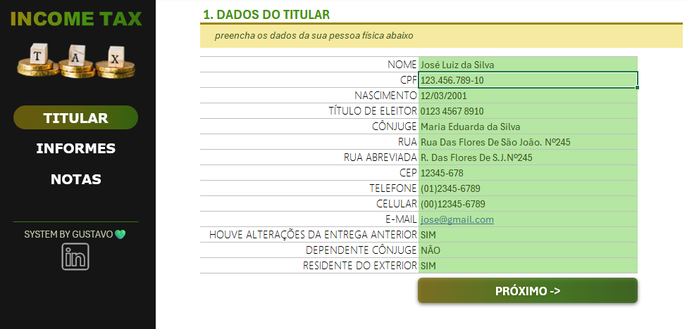
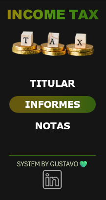
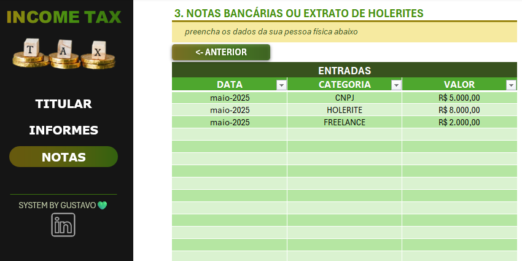

# 🧾 Organizador de Imposto de Renda em Excel

## 📌 Descrição

Este projeto foi desenvolvido como parte do curso de Excel da DIO. A proposta é criar uma ferramenta prática e eficiente para ajudar no controle das informações exigidas na declaração de Imposto de Renda Pessoa Física (IRPF). A planilha automatiza cálculos, organiza dados de forma clara e oferece uma interface intuitiva para o usuário.

## 🎯 Objetivos

- Facilitar o controle das informações financeiras exigidas na declaração anual  
- Automatizar cálculos e garantir a consistência dos dados inseridos  
- Proporcionar uma interface amigável e intuitiva ao usuário

## 🛠 Funcionalidades

- Botões com **links internos** para navegação entre abas  
- Link externo para o perfil do criador no **LinkedIn**  
- **Validação de dados** para garantir entradas corretas  
- **Proteção da planilha** para evitar alterações acidentais  
- Estrutura organizada em abas para facilitar o preenchimento

## 📂 Estrutura da Planilha

- **Dados Pessoais**: Coleta informações como nome, telefone, e-mail, CPF e endereço.  
- **Bancos**: Cadastro das instituições bancárias utilizadas, saldo disponível em cada uma e campo para anexar PDF do extrato.  
- **Entradas**: Lançamento de valores recebidos, data da entrada e descrição da origem (ex: holerite, CNPJ, freelance).

## 🖼 Capturas de Tela

Aqui estão algumas imagens da planilha para ilustrar a ferramenta:

### Dados Pessoais preenchidos  

### Navegação entre abas usando botões internos  

### Exemplo de lançamento de entrada  

## 🔗 Links Externos

- [Perfil no LinkedIn do Criador](https://www.linkedin.com/in/eugustavocardoso/)
## 🚀 Como Usar

1. Baixe o arquivo `imposto_de_renda.xlsx`  
2. Abra no Excel (preferencialmente a versão desktop)  
3. Preencha os dados nas abas correspondentes  
4. Use os botões para navegar e conferir os cálculos

## 📚 Aprendizados

Este projeto foi essencial para consolidar conhecimentos em:
- Aplicação prática de funções e validações no Excel  
- Organização de dados para montar uma planilha estruturada  
- Documentação técnica e publicação de projetos no GitHub
